# ProgBasica
# Programación Basica
## Introducción
Python es un lenguaje de programación poderoso y fácil de aprender. Cuenta con estructuras de datos
eficientes y de alto nivel y un enfoque simple pero efectivo a la programación orientada a objetos. La
elegante sintaxis de Python y su tipado dinámico, junto con su naturaleza interpretada, hacen de éste un
lenguaje ideal para scripting y desarrollo rápido de aplicaciones en diversas áreas y sobre la mayoría de
las plataformas.
## ¿Porque python?
Python es un lenguaje de muy alto nivel que permite expresar algoritmos de forma casi directa (ha llegado a considerarse «pseudocódigo ejecutable») y hemos comprobado que se trata de un lenguaje particularmente adecuado para la enseñanza de la programación. Esta impresión se ve corroborada por la adopción de Python como lenguaje introductorio en otras universidades. Otros lenguajes, como Java, C o C#, exigen una gran atención a multitud de detalles que dificultan la implementación de algoritmos a un estudiante que se enfrenta por primera vez al desarrollo de programas. No obstante, son lenguajes de programación de referencia y deberían formar parte del currículum de todo informático. Aprender Python como primer lenguaje permite estudiar las estructuras de control y de datos básicas con un alto nivel de abstracción y, así, entender mejor qué supone exactamente la mayor complejidad de
la programación en otros lenguajes y hasta qué punto es mayor el grado de control que nos otorgan. Por ejemplo, una vez se han estudiado listas en Python, su implementación en otros lenguajes permite al estudiante no perder de vista el objetivo último: construir una entidad con cierto nivel de abstracción usando las herramientas concretas proporcionadas por el lenguaje. De algún modo, pues, Python ayuda al aprendizaje posterior de otros lenguajes, lo que proporciona al estudiante una visión más rica y completa de la programación. Las similitudes y diferencias entre los distintos lenguajes permiten al estudiante inferir más fácilmente qué es fundamental y qué accesorio o accidental al diseñar programas en un lenguaje de programación cualquiera.
# Programas
## Ejercicio 1: dirección postal
Cree un programa que muestre su nombre y la dirección de correo completa formateada en
la forma en que normalmente lo verías en el exterior de un sobre. Su programa
no necesita leer ninguna entrada del usuario.

Como vemos en la imagen, el comando **print** lo ocupamos para una salida de texto dando como entendido imprimir en pantalla, este va acompañado de comillas refetene a todo lo que esta dentro de las comillas es la salida de nuestro texto.

\
En esta imagen se muestra nuestra salida de texto y lo que nuestro programa hace al momento de correrlo.
## Ejercicio 2: Hola
Escriba un programa que le pida al usuario que ingrese su nombre. El programa debe
responda con un mensaje que diga hola al usuario, usando su nombre.
\

\
Utilizando una variable llamada **nombre** daremos la entrada al dato tipo string, en este caso le pediremos el nombre al usurio, con el comando print daremos la salida a este dato dandole una hola de tipo string mas la variable que llamamos nombre.
\

\
Nuestra salida de datos es nuestro nombre mas un hola como bienvenida.

## Ejercicio 3: Área de una habitación.
Un programa que calcula el área, introduciendo el largo y el ancho en metros.
\
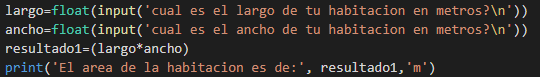
\
En este ejercicio crearemos un progreama que nos ayude a calcular un area, para ello nosotros daremos entrada a dos variables que seran ingresadas por el susuario, una de ellas esta como *largo* y otra como *ancho* seran del tipo float para nuestra operacion creearemos una cariable llamada *resultado* que multiplicara nuestras primera variables. Para nuestro resultado solo mandamos llamar resultado adjunto con una constante definida con '' para que muestro nuestro resultado.
\
.png)
\
Nuestra pantalla despues de correrla nos dira que ingresemos nuestro *ancho* y *largo* por separados y al final nos dara nuestro resultado. 
## Ejercicio 4: Área de un campo.
Un programa que calcula el área de un campo y lo despliega en acres.
\
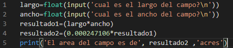
\
En este ejercicio nos piede que calculemos una area de un campo pero en acres, para este programa nosotros meteremos dos variables de tipo float en este caso pondremos *largo* y *ancho* tendremos dos para dos operaciones *operacion 1, operacion2* para la primera operacion tendremos calculda el area en metros y en la segunda la aremos para convertirlo a acres. Para nuestrao resultado con print tendremos solo *resultado2*
\
.png)
\
Para la ejecucion nos pedira como usuario ingresar nuestro *ancho, largo* del campo, y como resultado nos dara el area del campo pero en acres.
## Ejercicio 5: Depositos de botellas.
En muchas jurisdicciones se agrega un pequeño depósito a los envases de bebidas para alentar a las personas para reciclarlos En una jurisdicción particular, beba recipientes de un litro o menos tienen un depósito de $ 0.10, y los recipientes de bebidas que contienen más de un litro tienen Depósito de $ 0.25.
Escriba un programa que lea el número de contenedores de cada tamaño del usuario. Su programa debe continuar calculando y mostrando el reembolso que será recibido por devolver esos contenedores. Formatee la salida para que incluya un dólar
firmar y siempre muestra exactamente dos decimales.
\
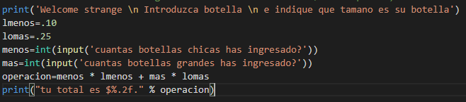
\
En este ejercicio nos pide que hagamos un programa en donde calculemos cuantas y de que tamaño son las botellas que se introducen en una maquina y cunato dinero se obtendra por cada una de ellas. Se muestra una bienvenida como constante, agreamos nuestras constantes que seran el coste de cada botellas que seran como *lmenos* para las botellas que son menos de un litro y *lomas* para el coste de botellas de mas de un litro, *menos* sera nuestra variable para que el usuario introduzca las botellas de menos de un litro y *mas* para botellas de mas de un litro, tendremos una *operacion* que esta sera para hacer el calculo del dinero que se resivira, como ultimo nuestro resultado solo sera el de *operacion*
\
.png) 
\
En ejecucion vemos como aparece nuestra bienvenida e intrucciones de la maquina, nos aparece cuantas botellas chicas y grandes han ingresado y como resultado aparece el dindero que recibiran.
## Ejercicio 6: Impuestos y propina.
El programa que cree para este ejercicio comenzará leyendo el costo de una comida ordenado en un restaurante del usuario. Entonces su programa calculará el impuesto y propina para la comida. Use su tasa impositiva local cuando calcule la cantidad de impuestos adeudados. Calcule la propina como el 18 por ciento de la cantidad de comida (sin el impuesto). La salida de
su programa debe incluir el monto de los impuestos, el monto de la propina y el total general de la comida incluye tanto el impuesto como la propina. Formatee la salida para que todos los valores se muestran con dos decimales.
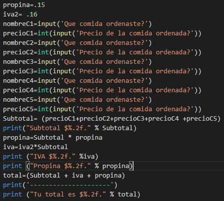
\
En este ejercicio se programara un ticket en donde el usuario ingresara que comio y que costo tiene cada comida, tambien calculara cuanto sera de propina y se incluira el iva, para ellos como constantes tendremos la *propina* con un .15 y el *iva2* con un.16, para que el programa pida que ordneo y que costo tiene se ingresara para el nombre de la comida *nombreC1 - nombreC5* y para el precio *precio1C - precioC5* tendremos una operacion llamada *subtotal* donde calculara desde *precioC1 - precioC5* ese mismo moneto lo represtara con print despues se calculara la propina y el iva los representamos con *propina e iva* los imprimirmos para la visualizacion con print para el total de pago se utiliza *total* y se imprime el toatal.
.png)
\
En la ejecucion del programa veremos que nos pedira primero comida y despues precio, nos aparecera nuestro subtotal sin iva y sin propina, nos represtara cuando sera de la propina y cuando sera del iva, el total nos dara la suma de todas estas.
## Ejercicio 7: Suma de los primeros numeros n enteros positivos.
Escriba un programa que lea un entero positivo, n, del usuario y luego muestre el suma de todos los enteros de 1 a n. La suma de los primeros n enteros positivos puede ser calculado usando la fórmula:sum = ((n)n+1)/2
\
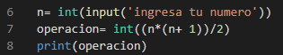
\
En este ejercico nos pide que hagamos un programa en donde el ususario ingrese un nuemero *n* y el programa sume todos estos por ejemplo 3= 1+2+3 = 6 para ellos nosotros pediremos un nuemro con la variable *n* y este le pedira al usuario agregar su numero que desea ser sumado en *operacion* se aregara la formula que nos de llegar a este resultado y solo imprimieremos *operacion*.
\
.png)
\
Para la ejecucucion nos pedira el numero y nos arrojara el resultado.
## Ejercicio 8: Cajas de cereal.
Un minorista en línea vende dos productos: widgets y artilugios. Cada widget pesa 75 gramos Cada artilugio pesa 112 gramos. Escribe un programa que lea el número de widgets y la cantidad de artilugios en un pedido del usuario. Entonces tu programa
debe calcular y mostrar el peso total de la orden.
\
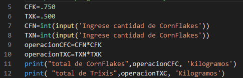
\
En este ejercicio nos pide que calculemos a base de cuantas cajas de cada producto, para este caso tendremos como constantes *cfk* y *txk* para referirnos a los gramos de cada caja. Le pediremos al usuario que ingrese la catidad de cada una con variables *cfn* y *txn* tendremos *operacioncfn* y *operaciontxt* para cada tipo de operaciones y finalmente las imprimimos por separado dandode referencia a cada una de las dos operaciones.
\
.png)
\
En la ejecucion del programa nos pedira ingresar la cantidad de cajas de cada una de ellas y nos mostrara cuanto pesa todo lo que hemos ingresado.
## Ejercicio 9: Interés compuesto.
Imagina que acabas de abrir una nueva cuenta de ahorros que genera un interés del 4% por año. El interés que gana se paga al final del año y se agrega al saldo de la cuenta de ahorro. Escriba un programa que comience leyendo el cantidad de dinero depositada en la cuenta del usuario. Entonces su programa debería calcule y muestre el monto en la cuenta de ahorros después de 1, 2 y 3 años. Monitor cada cantidad para que se redondee a 2 decimales.
\
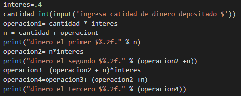
\
En este programa nos pide calcular a base de los intereses cuanto dinero tendremos en 1ro, 2do y tercer año con un interes del 4% para este programa nosotros tendremos una constante marcada como *interes* le pediremos al usuario cuanto a depositar con la variable *cantidad*, tendremos *operacion1* para calcular cunato sera el interes que se generara tendremos otra operacion llamda *n* para saber el dinero del primer año el cual se reflejara con el print, tendremos *operacion2* en este se multiplicara el primero con el interes el cual se reflejara haciendo la suma en print, para el tercero utilizamos la suma del segundo que es *operacion2 +2 * y lo multiplicamos por el interes, utilizamos *operacion4* para hacer la suma del resultado de *operacion3* en este momento la imprimimos con print para el tercer resultado.
\
.png)
\
En la ejecucion del programa solos nos pide la primera cantidad y nos dara el resultado de los tres.
## Ejercicio 10: Aritmética.
Cree un programa que lea dos enteros, a y b, del usuario. Su programa debe calcular y mostrar: 
• La suma de a y b 
• La diferencia cuando b se resta de a 
• El producto de a y b 
• El cociente cuando a se divide por b 
• El resto cuando a se divide por b 
• El resultado de log10 a 
• El resultado de ab.
\
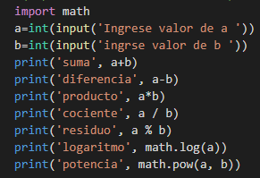
\
En este ejecicio lo que tendremos que hacer es que le pediremos al usuario dos numeros y este programa hara, *suma, resta, multimplicacion, division, residuo, logaritmo y elevarlo* lo unico que se hace es pedrile al usuario co dos variables en este caso *a y b* y lo demas se declarara al momento de visualizar. Se utulizara una libreria especial para poder elevar los numeros a una opetencia esta es la pimera que se muestra como *import math* es muy importante para que nosotros podamos utilizar estas funciones tanto como los logartmos como las potencias.
\
.png)
\
En la ejecucion del programa solo daremos los dos valores y todo lo demas se calculara por si solo.
## Ejercicio 11: Eficiencia de combustible.
En los Estados Unidos, la eficiencia del combustible para vehículos normalmente se expresa en millas por galón (MPG). En Canadá, la eficiencia del combustible normalmente se expresa en litros por cien kilómetros (L / 100 km). Usa tus habilidades de investigación para determinar cómo convertir de MPG a L / 100 km. Luego cree un programa que lea un valor del usuario en América unidades y muestra la eficiencia de combustible equivalente en unidades canadienses.
\
.png)
\
En este ejercicio nos pide hace una conversion de sistema US al sistema internacional de millas por galon a litros por 100 km para esto se utilizara la variable *USD* para que el ususuario introduzca su valor en el sistema EU tendremos nuestra conste *SI* que sera nuestra referencia para convertilos a listros por 100km, para ellos tendremos *operacion* para que se multimplique nuestro valor agregado por nuestra constante, finalmente se imprime para ver el resiltado mostrado.
\
.png)
\
Al ejecutar el programa el usuario ingresara el valor dado en sistema EU y nuestro resultado se mostrara en L por 100km.
## Ejercicio 12: Distancia entre dos puntos en la Tierra.
La superficie de la Tierra es curva, y la distancia entre los grados de longitud varía con la latitud. Como resultado, encontrar la distancia entre dos puntos en la superficie de la Tierra es más complicado que simplemente usar el teorema de Pitágoras. Sea (t1, g1) y (t2, g2) la latitud y longitud de dos puntos en la superficie de la Tierra. La distancia entre estos puntos, siguiendo la superficie de la Tierra, en kilómetros es:
distance = 6371.01 × arccos(sin(t1) × sin(t2) + cos(t1) × cos(t2) × cos(g1 − g2))
Cree un programa que permita al usuario ingresar la latitud y longitud de dos puntos en la Tierra en grados. Su programa debe mostrar la distancia entre los puntos, siguiendo la superficie de la tierra, en kilómetros.
\
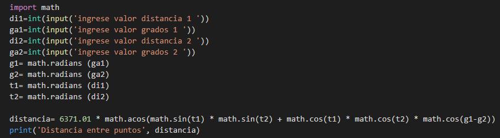
\
En este ejercicio se hara un programa que nos ayude a calcular la distancia en puntos a traves de la latitud que seran *ga1* y a traves des la longitud *dis1*, esos valores seran dados por el usuario, crearemos otras variables como *g1,g2,t1,t2* para que nuestros valores sean tomados como radianes. crearemos una operacion llamada *distancia* la cual incluira la formulara de Pitagoras, se mandara a llamar con nuestro print para que nos arroje nuestro resultado.
\
.png)
\
En la ejecucion del programa le pedira al usuario ingresar los valores de distancia el valor de los grados y finalmente nos dara nuestra distancia que existe entre esos dos puntos.
## Ejercicio 13: Haciendo el cambio.
Considere el software que se ejecuta en una máquina de autopago. Una tarea que debe poder realizar es determinar cuánto cambio proporcionar cuando el comprador paga una compra en efectivo. Escriba un programa que comience leyendo una cantidad de centavos del usuario como entero. Luego, su programa debe calcular y mostrar las denominaciones de las monedas que se deben usar para dar esa cantidad de cambio al comprador. El cambio debe darse usando la menor cantidad de monedas posible. Suponga que la máquina está cargada de centavos, monedas de cinco centavos, monedas de diez centavos, cuartos, loonies and toonies.
\
.png)
\
En este ejercicio nos pide que a base a las modenedas que nos dan hagamos un programa que el usuario ingrese cuantos centavamos y con ellos la maquina de su cambio utilizando la menor cantidad de centavos, para ellos vemos el valor de las moendas y las agregamos como nuestras constates *toonies, locos, m1cuar, m10 y m5*
crearemos dos operaciones *centavos1,centavos11, centavos2,centavos22, centavos3, centavos33, centavos4, centavos44, centavos5, centavos55* esto para saber cuantos centavos se tienen que dar por cada moneda.
\
.png)
\
En la ejecucion del programa nos pedira que ingresemos la cantidad de centabos y en la nos idra cunato tendra que dar la maquina en centavos.
## Ejercicio 14: Unidades de altura.
Muchas personas piensan en su altura en pies y pulgadas, incluso en algunos países que utilizan principalmente el sistema métrico. Escriba un programa que lea un número de pies del usuario, seguido de un número de pulgadas. Una vez que se leen estos valores, su programa debe calcular y mostrar el número equivalente de centímetros.
\
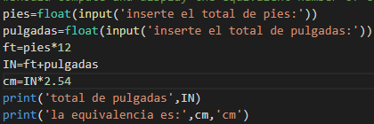
\
En este ejercico nos pide comvertir pulgas y pies al sistema metrico para ellos nosotros le pediremos al usuario los pies y pulgudas lo unico que sera es hacer operaciones con *ft y in* para ellos tendremos que saber cunado es su equivalencia y hacer su pultiplicacion.
\
.png)
\
Para la ejecucion del programa se le pedira al usuario que ingrese cada uno de los datos para que asi cea el resultado mostrado.
## Ejercicio 15: Unidades de distancia.
En este ejercicio, creará un programa que comienza leyendo una medida en pies del usuario. Luego, su programa debe mostrar la distancia equivalente en pulgadas, yardas y millas. Use Internet para buscar los factores de conversión necesarios si no los tiene memorizados.
\
.png)
\
Este ejercicio nos pide que el usuario ingrese la medida en pies y el programa nos de la equivalencia en yardas, pulgadas y millas, para ello investigaremos sus equivalencias y le pediremos al usuario que ingrese *pies*, haremos las operaciones con *pulgadas, yardas y millas* echas esas operaciones solo mandaremos llamar con print para poder ver el resultado de cada una de ellas.
\
.png)
\
En la ejecucion del programa nos pide pedira que ingresemos la cantidad de pies y automaticamente nos dira sus equivalencias.
## Ejercicio 16: Área y Volumen.
Escriba un programa que comience leyendo un radio, r, del usuario. El programa continuará calculando y mostrando el área de un círculo con radio r y el volumen de una esfera con radio r. Use la constante pi en el módulo matemático en sus cálculos.
\
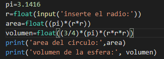
\
En este ejecicio nos pide que realicemos un programa para que el programa nos de el area y el volumen de una esfera, para ellos le pediremos al usuario que ingrese su radio *r* para que con dos operaciones llamadas *area y volumen* realicen los resultados en estas operaciones tendremos que introducir las formulas correspondientes. Tambien tendremos que utilizar pi como constente.
\
.png)
\
La ejecucion del programa nos pedira solo insertar el radio del circulo y los resultados nos lo arrojara automaticamente.
## Ejercicio 17: Capacidad calorífica.
La cantidad de energía requerida para aumentar la temperatura de un gramo de un material en un grado Celsius es la capacidad de calor específica del material, C. La cantidad total de energía requerida para elevar m gramos de un material en ΔT grados Celsius se puede calcular usando el fórmula: q = mT T
Escriba un programa que lea la masa de un poco de agua y el cambio de temperatura del usuario. Su programa debe mostrar la cantidad total de energía que debe agregarse o eliminarse para lograr el cambio de temperatura deseado.
Extienda su programa para que también calcule el costo de calentar el agua. La electricidad se factura normalmente utilizando unidades de kilovatios hora en lugar de julios. En este ejercicio, debe asumir que la electricidad cuesta 8.9 centavos por kilovatio-hora. Use su programa para calcular el costo de hervir agua para una taza de café.
\
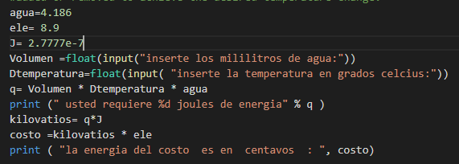
\
En este ejercicio nos pide que calculemos cunatos jolules de energia necesitariamos para que una cierta cantidad de agua llegue a una temperatura deseada, para ello vamos a conciderar *agua* la constate de capacidad calorifica del agua, *ele* que sera para el coste que tiene en centavamos por kilovaltios y nuestros *j* de joules, el usuario solo introducira los mililitros de agua y la temperatura requeria, el programa nos dara automaticamente con las formulas cunato se requiere en joules y cunato nos costaria por llevarla a esa temperatura.
\
.png)
\
En la ejecucion vemos como se le indica ingresar los mililitros del agua y los grados en Celcius a los qu ese requiere llevar, lodemas nos los da automaticamente el programa.
## Ejercicio 18: Volumen de un cilindro.
El volumen de un cilindro se puede calcular multiplicando el área de su base circular por su altura. Escriba un programa que lea el radio del cilindro, junto con su altura, del usuario y calcule su volumen. Muestra el resultado redondeado a un decimal.
\
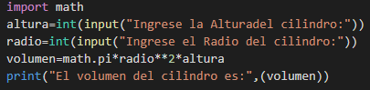
\
En este ejercicio nos piden que a partir de una altura y un radio calculemos el volumen de un cilindro, para esto le pediremos al usuario que ingrese una altura y un radio para que con la operacion en donde tendra la formuala para calcular el volumen. Importaremos *import math* para agregar pi a la formula.
\
.png)
\
En la ejecucion veremos como nos pide la altura y el radio y vemos que automaticamente nos arroja el volumen.
## Ejercicio 19: Caida libre.
Cree un programa que determine qué tan rápido viaja un objeto cuando toca el suelo. El usuario ingresará la altura desde la cual se cae el objeto en metros (m). Debido a que el objeto se cae, su velocidad inicial es de 0 m / s. Suponga que la aceleración debida a la gravedad es 9.8 m / s2. Puede usar la fórmula vf = v2 i + 2ad para calcular velocidad final, vf, cuando se conoce la velocidad inicial, vi, aceleración, a y distancia.
\
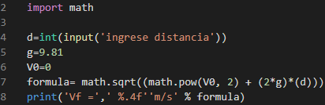
\
En este ejercicio nos pide que calculemos la velocidad final de un objeto a partir de la distancia que ingresara el usuaruio, para ello le pediremos al usuario que ingrese la distancia con *d* nuestras constantes seran la gravedad y la velocidad inicial *g y V0* insertamos la operacion que sera la formula de la velocidad final. Se importa *impor math* para poder utilizar raiz cuadrada.
.png)
\
Como vemos en la ejecucion del programa se ingresa la distancia y automaticamente nos da nuestra velodicad final.
## Ejercicio 20: Ley del gas ideal.
La ley de los gases ideales es una aproximación matemática del comportamiento de los gases a medida que cambian la presión, el volumen y la temperatura. Por lo general, se indica como: PV=nRT
donde P es la presión en Pascales, V es el volumen en litros, n es la cantidad de sustancia en moles, R es la constante de gas ideal, igual a 8.314 J mol K, y T es la temperatura en grados Kelvin.
Escriba un programa que calcule la cantidad de gas en moles cuando el usuario suministra la presión, el volumen y la temperatura. Pruebe su programa determinando la cantidad de moles de gas en un tanque de buceo. Un tanque típico de SCUBA contiene 12 litros de gas a una presión de 20,000,000 Pascales (aproximadamente 3,000 PSI). La temperatura ambiente es de aproximadamente 20 grados Celsius o 68 grados Fahrenheit.
\
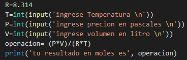
\
En este ejercicio haremos un programa que nos ayude a calcular la catidad de gas en moles, para ellos el usuario va introducir; temperatura, presion y volumen esto sera dado como *T, P, V* se era la operacion de los gases nombles tendremos nuestra constate *R* y solo se mandara llamar *operacion* a print para ver el resultado.
.png)
\
En la ejecucion del programa nos pedira los datos de temperatura, presion y volumen y nos mostrara automaticamente nuestro resultado en moles.
## Ejercicio 21: Área de un triángulo.
El área de un triángulo se puede calcular usando la siguiente fórmula, donde b es la longitud de la base del triángulo y h es su altura: área= (b x a)/2
Escriba un programa que permita al usuario ingresar valores para byh. Luego, el programa debe calcular y mostrar el área de un triángulo con longitud base by altura h.
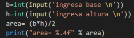
.png)
## Ejercicio 22: Área de un triángulo (de nuevo).
En el ejercicio anterior, creó un programa que calculaba el área de un triángulo cuando se conocía la longitud de su base y su altura. También es posible calcular el área de un triángulo cuando se conocen las longitudes de los tres lados. Sean s1, s2 y s3 las longitudes de los lados. Sea s = (s1 + s2 + s3) / 2. Luego, el área del triángulo se puede calcular utilizando la siguiente fórmula:  area = (srqrt )s × (s − s1) × (s − s2) × (s − s3)
Desarrolle un programa que lea las longitudes de los lados de un triángulo del usuario y muestre su área.
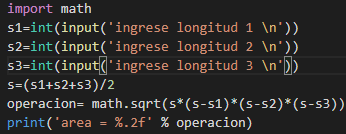
.png)
## Ejercicio 23: Área de un polígono regular.
Un polígono es regular si sus lados tienen la misma longitud y los ángulos entre todos los lados adyacentes son iguales. El área de un polígono regular se puede calcular usando la siguiente fórmula, donde s es la longitud de un lado yn es el número de lados: 
area = (n × s^2)/ ((4 × tan( (π /n))
Escriba un programa que lea s y n del usuario y luego muestre el área de un polígono regular construido a partir de estos valores.
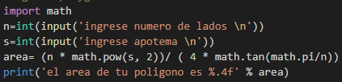
.png)
## Ejercicio 24: Unidades de tiempo.
Cree un programa que lea una duración del usuario como un número de días, horas, minutos y segundos. Calcule y muestre el número total de segundos representado por esta duración.
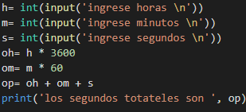
.png)
## Ejercicio 25: Unidades de tiempo 2.
En este ejercicio revertirá el proceso descrito en el ejercicio anterior. Desarrolle un programa que comience leyendo un número de segundos del usuario. Luego, su programa debe mostrar la cantidad de tiempo equivalente en la forma D: HH: MM: SS, donde D, HH, MM y SS representan días, horas, minutos y segundos respectivamente. Las horas, minutos y segundos deben estar formateados para que ocupen exactamente dos dígitos, con un 0 inicial si es necesario.
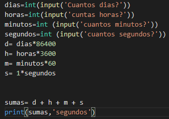
.png)
## Ejercicio 26: Tiempo actual.
Python incluye una biblioteca de funciones para trabajar con el tiempo, incluida una función llamada asctime en el módulo de tiempo. Lee la hora actual del reloj interno de la computadora y la devuelve en un formato legible para humanos. Escriba un programa que muestre la hora y fecha actuales. Su programa no requerirá ninguna entrada del usuario.
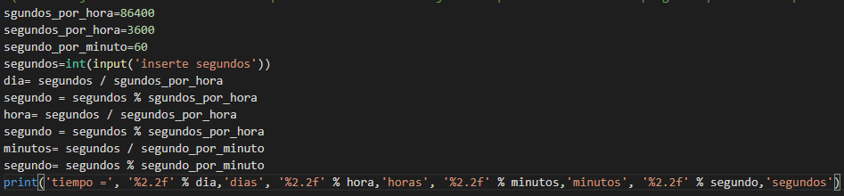
.png)
## Ejercicio 27: Índice de masa corporal
Escriba un programa que calcule el índice de masa corporal (IMC) de un individuo. Su programa debe comenzar leyendo una altura y un peso del usuario. Luego, debe usar una de las siguientes dos fórmulas para calcular el IMC antes de mostrarlo. Si lee la altura en pulgadas y el peso en libras, el índice de masa corporal se calcula utilizando la siguiente fórmula: BMI = weight/(( height × height)) × 703.
Si lee la altura en metros y el peso en kilogramos, el índice de masa corporal se calcula utilizando esta fórmula un poco más simple: BMI = weight / (height × height)
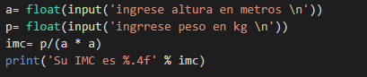
.png)
## Ejercicio 28: Escalofríos.
Cuando el viento sopla en clima frío, el aire se siente aún más frío de lo que realmente es porque el movimiento del aire aumenta la velocidad de enfriamiento de los objetos cálidos, como las personas. Este efecto se conoce como sensación térmica.
En 2001, Canadá, el Reino Unido y los Estados Unidos adoptaron la siguiente fórmula para calcular el índice de sensación térmica. Dentro de la fórmula Ta está la temperatura del aire en grados Celsius y V es la velocidad del viento en kilómetros por hora. Se puede usar una fórmula similar con diferentes valores constantes con temperaturas en grados Fahrenheit y velocidades del viento en millas por hora.
WCI = 13.12 + 0.6215T_a − 11.37V^0.16 + 0.3965T_aV^0.16
Escriba un programa que comience leyendo la temperatura del aire y la velocidad del viento del usuario. Una vez que se hayan leído estos valores, su programa debería mostrar el índice de enfriamiento del viento redondeado al entero más cercano.
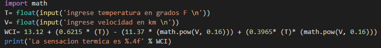
.png)
## Ejercicio 29: Celsius a Fahrenheit y Kelvin.
Escriba un programa que comience leyendo una temperatura del usuario en grados Celsius. Luego, su programa debe mostrar la temperatura equivalente en grados Fahrenheit y grados Kelvin. Los cálculos necesarios para convertir entre diferentes unidades de temperatura se pueden encontrar en Internet.
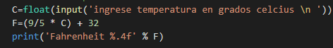
.png)
## Ejercicio 30: Unidades de presión.
En este ejercicio creará un programa que lee la presión del usuario en kilopascales. Una vez que se haya leído la presión, su programa debe informar la presión equivalente en libras por pulgada cuadrada, milímetros de mercurio y atmósferas. Usa tus habilidades de investigación para determinar los factores de conversión entre estas unidades.
.png)
.png)
## Ejercicio 31: Suma de los dígitos en un entero.
Desarrolle un programa que lea un número entero de cuatro dígitos del usuario y muestre la suma de los dígitos en el número. Por ejemplo, si el usuario ingresa 3141, entonces su programa debería mostrar 3 + 1 + 4 + 1 = 9.
.png)
.png)
## Ejercicio 32: Ordenar 3 enteros.
Cree un programa que lea tres enteros del usuario y los muestre en orden ordenado (de menor a mayor). Use las funciones min y max para encontrar los valores más pequeños y más grandes. El valor medio se puede encontrar calculando la suma de los tres valores y luego restando el valor mínimo y el valor máximo
.png)
.png)
## Ejercicio 33: Pan de un día.
Una panadería vende hogazas de pan por $ 3.49 cada una. El pan de un día tiene un descuento del 60 por ciento. Escriba un programa que comience leyendo la cantidad de hogazas de pan de un día compradas al usuario. Luego, su programa debe mostrar el precio regular del pan, el descuento porque tiene un día de antigüedad y el precio total. Todos los valores deben mostrarse con dos decimales, y los puntos decimales en todos los números deben alinearse cuando el usuario ingresa valores razonables
.png)
.png)
## Ejercicio 34: ¿Par o impar?.
Escriba un programa que lea un número entero del usuario. Luego, su programa debe mostrar un mensaje que indique si el número entero es par o impar.
.png)
.png)
## Ejercicio 35: Años de perro.
Se dice comúnmente que un año humano es equivalente a 7 años de perro. Sin embargo, esta simple conversión no reconoce que los perros alcanzan la edad adulta en aproximadamente dos años. Como resultado, algunas personas creen que es mejor contar cada uno de los primeros dos años humanos como 10.5 años de perro, y luego contar cada año humano adicional como 4 años de perro.
Escriba un programa que implemente la conversión de años humanos a años de perros descritos en el párrafo anterior. Asegúrese de que su programa funcione correctamente para conversiones de menos de dos años humanos y para conversiones de dos o más años humanos. Su programa debe mostrar un mensaje de error apropiado si el usuario ingresa un número negativo.
.png)
.png)
## Ejercicio 36: Vocal o Consonante.
En este ejercicio creará un programa que lee una letra del alfabeto del usuario. Si el usuario ingresa a, e, i, o u, entonces su programa debe mostrar un mensaje que indica que la letra ingresada es una vocal. Si el usuario ingresa y, entonces su programa debería mostrar un mensaje que indica que a veces y es una vocal, y a veces y es una consonante. De lo contrario, su programa debería mostrar un mensaje que indica que la letra es una consonante.
.png)
.png)
## Ejercicio 37: Nombra esa forma.
Escriba un programa que determine el nombre de una forma a partir de su número de lados. Lea el número de lados del usuario y luego informe el nombre apropiado como parte de un mensaje significativo. Su programa debe admitir formas con desde 3 hasta (e incluyendo) 10 lados. Si se ingresa un número de lados fuera de este rango, entonces su programa debería mostrar un mensaje de error apropiado.
.png)
.png)
## Ejercicio 38: Nombre del mes a la cantidad de días.
La duración de un mes varía de 28 a 31 días. En este ejercicio creará un programa que lee el nombre de un mes del usuario como una cadena. Luego, su programa debería mostrar la cantidad de días en ese mes. Muestre “28 o 29 días” para febrero para que se aborden los años bisiestos.
.png)
.png)
## Ejercicio 39: Niveles de sonido.
La siguiente tabla enumera el nivel de sonido en decibelios para varios ruidos comunes.
Jackhammer 130db
Gas lawnmower 106db
 Alarm clock 70db
Quiet room 40db
Escriba un programa que lea un nivel de sonido en decibelios del usuario. Si el usuario ingresa un nivel de decibelios que coincide con uno de los ruidos en la tabla, entonces su programa debería mostrar un mensaje que contenga solo ese ruido. Si el usuario ingresa una cantidad de decibelios entre los ruidos enumerados, entonces su programa debe mostrar un mensaje que indique entre qué ruidos se encuentra el nivel. Asegúrese de que su programa también genere salida razonable para un valor más pequeño que el ruido más bajo en la tabla, y para un valor más grande que el ruido más alto en la tabla.
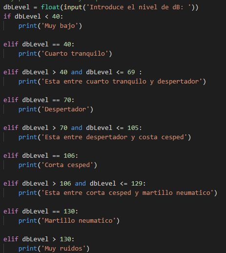
.png)
## Ejercicio 40: Nombra ese triángulo.
Un triángulo se puede clasificar en función de la longitud de sus lados como equilátero, isósceles o escaleno. Los 3 lados de un triángulo equilátero tienen la misma longitud. Un triángulo isósceles tiene dos lados que tienen la misma longitud y un tercer lado que tiene una longitud diferente. Si todos los lados tienen diferentes longitudes, entonces el triángulo es escaleno. Escriba un programa que lea las longitudes de 3 lados de un triángulo del usuario. Mostrar un mensaje que indique el tipo de triángulo
.png)
.png)
## Ejercicio 41: Nota a frecuencia.
La siguiente tabla enumera una octava de notas musicales, comenzando con C central, junto con sus frecuencias.
C4 261.63hz
D4 293.66hz
E4 329.63hz
 F4 349.23hz
G4 392.00hz
A4 440.00hz
 B4 493.88hz
Comience escribiendo un programa que lea el nombre de una nota del usuario y muestre la frecuencia de la nota. Su programa debe admitir todas las notas enumeradas anteriormente. Una vez que tenga su programa funcionando correctamente para las notas enumeradas anteriormente, debe agregar soporte para todas las notas de C0 a C8. Si bien esto podría hacerse agregando muchos casos adicionales a su declaración if, dicha solución es engorrosa, inelegante e inaceptable para los propósitos de este ejercicio. En cambio, debe explotar la relación entre las notas en octavas adyacentes. En particular, la frecuencia de cualquier nota en octava n es la mitad de la frecuencia de la nota correspondiente en octava n + 1. Al usar esta relación, debería poder agregar soporte para las notas adicionales sin agregar casos adicionales a su declaración if.
.png)
.png)
## Ejercicio 42: Frecuencia a tener en cuenta.
En la pregunta anterior, convertiste del nombre de la nota a la frecuencia. En esta pregunta escribirás un programa que revierte ese proceso. Comience leyendo una frecuencia del usuario. Si la frecuencia está dentro de un Hertz de un valor que figura en la tabla de la pregunta anterior, informe el nombre de la nota. De lo contrario, informe que la frecuencia no corresponde a una nota conocida. En este ejercicio solo necesita considerar las notas enumeradas en la tabla. No hay necesidad de considerar notas de otras octavas.
.png)
.png)
## Ejercicio 43: Caras sobre el dinero.
Es común que las imágenes de los líderes anteriores de un país, u otras personas de importancia histórica, aparezcan en su dinero. Las personas que aparecen en los billetes en los Estados Unidos se enumeran en la Tabla.
Escriba un programa que comience leyendo la denominación de un billete del usuario. Luego, su programa debe mostrar el nombre de la persona que aparece en el
George Washington $1 
Thomas Jefferson $2 
Abraham Lincoln $5 
Alexander Hamilton $10 
Andrew Jackson $20 
Ulysses S. Grant $50 
Benjamin Franklin $100
billete de la cantidad ingresada. Se debe mostrar un mensaje de error apropiado si no existe dicha nota.
.png)
.png)
## Ejercicio 44: Fecha de nombre de vacaciones.
Canadá tiene tres feriados nacionales que caen en las mismas fechas cada año.
New year’s day January 1 
Canada day July 1 
Christmas day December 25
Escriba un programa que lea un mes y un día del usuario. Si el mes y el día coinciden con uno de los feriados enumerados anteriormente, entonces su programa debería mostrar el nombre del feriado. De lo contrario, su programa debería indicar que el mes y el día ingresados no corresponden a un día festivo de fecha fija.
.png)
.png)
## Ejercicio 45: ¿De qué color es ese cuadrado?.
Las posiciones en un tablero de ajedrez se identifican con una letra y un número. La letra identifica la columna, mientras que el número identifica la fila, como se muestra a continuación:
Escriba un programa que lea una posición del usuario. Use una declaración if para determinar si la columna comienza con un cuadrado negro o un cuadrado blanco. Luego use la aritmética modular para informar el color del cuadrado en esa fila. Por ejemplo, si el usuario ingresa a1, su programa debe informar que el cuadrado es negro. Si el usuario ingresa d5, entonces su programa debe informar que el cuadrado es blanco. Su programa puede asumir que siempre se ingresará una posición válida. No necesita realizar ninguna comprobación de errores.
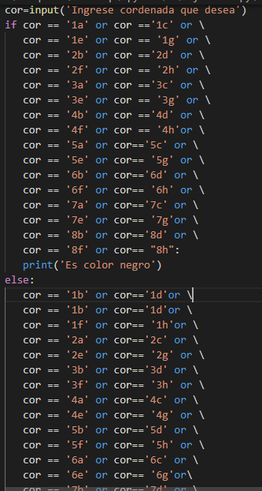
.png)
.png)
## Ejercicio 46: Temporada de mes y día.
El año se divide en cuatro estaciones: primavera, verano, otoño e invierno. Si bien las fechas exactas en que cambian las estaciones varían un poco de un año a otro debido a la forma en que se construye el calendario, utilizaremos las siguientes fechas para este ejercicio:
Spring March 20 
Summer June 21
Fall September 22 
Winter December 21
Cree un programa que lea un mes y un día del usuario. El usuario ingresará el nombre del mes como una cadena, seguido del día dentro del mes como un entero. Luego, su programa debe mostrar la temporada asociada con la fecha que se ingresó.
.png)
.png)
## Ejercicio 47: Fecha de nacimiento astrológica.
Los horóscopos comúnmente reportados en los periódicos usan la posición del sol en el momento del nacimiento para intentar predecir el futuro. Este sistema de astrología divide el año en doce signos del zodiaco, como se describe en la tabla a continuación:
Capricorn December 22 to January 19 
Aquarius January 20 to February 18 
Pisces February 19 to March 20 
Aries March 21 to April 19
 Taurus April 20 to May 20 
Gemini May 21 to June 20 
Cancer June 21 to July 22 
Leo July 23 to August 22
 Virgo August 23 to September 22 
Libra September 23 to October 22 
Scorpio October 23 to November 21 
Sagittarius November 22 to December 21
Escriba un programa que le pida al usuario que ingrese su mes y día de nacimiento. Luego, su programa debe informar el signo zodiacal del usuario como parte de un mensaje de salida apropiado.
.png)
.png)
## Ejercicio 48: Zodiaco chino.
El zodiaco chino asigna animales a años en un ciclo de 12 años. Un ciclo de 12 años se muestra en la tabla a continuación. El patrón se repite a partir de ahí, con 2012 siendo otro año del dragón, y 1999 siendo otro año de la liebre.
2000 Dragon 
2001 Snake 
2002 Horse 
2003 Sheep 
2004 Monkey 
2005 Rooster 
2006 Dog 
2007 Pig 
2008 Rat 
2009 Ox 
2010 Tiger 
2011 Hare
Escriba un programa que lea un año del usuario y muestre el animal asociado con ese año. Su programa debería funcionar correctamente durante cualquier año mayor o igual a cero, no solo los que figuran en la tabla
.png)
.png)
## Ejercicio 49: Escala de richter.
La siguiente tabla contiene rangos de magnitud de terremotos en la escala de Richter y sus descriptores:
Less than 2.0 Micro 
2.0 to less than 3.0 Very minor 
3.0 to less than 4.0 Minor 
4.0 to less than 5.0 Light 
5.0 to less than 6.0 Moderate 
6.0 to less than 7.0 Strong 
7.0 to less than 8.0 Major 
8.0 to less than 10.0 Great 
10.0 or more Meteoric
Escriba un programa que lea una magnitud del usuario y muestre el descriptor apropiado como parte de un mensaje significativo. Por ejemplo, si el usuario ingresa 5.5, su programa debe indicar que un terremoto de magnitud 5.5 se considera un terremoto moderado.
.png)
.png)
## Ejercicio 50: Raíces de una función cuadrática.
Una función cuadrática univariada tiene la forma f (x) = ax2 + bx + c, donde a, byc son constantes, y a no es cero. Las raíces de una función cuadrática se pueden encontrar al encontrar los valores de x que satisfacen la ecuación cuadrática ax2 + bx + c = 0. Una función cuadrática puede tener 0, 1 o 2 raíces reales. Estas raíces se pueden calcular utilizando la fórmula cuadrática, que se muestra a continuación: root = −b ± √ b2 − 4ac/2a
La parte de la expresión debajo del signo de raíz cuadrada se llama discriminante. Si el discriminante es negativo, entonces la ecuación cuadrática no tiene raíces reales. Si el discriminante es 0, entonces la ecuación tiene una raíz real. De lo contrario, la ecuación tiene dos raíces reales, y la expresión debe evaluarse dos veces, una vez con un signo más y otra con un signo menos, al calcular el numerador.
Escriba un programa que calcule las raíces reales de una función cuadrática. Su programa debe comenzar solicitando al usuario los valores de a, byc. Luego, debe mostrar un mensaje que indique el número de raíces reales, junto con los valores de las raíces reales (si las hay)
.png)
.png)
## Ejercicio 51: Calificación de letras a puntos de calificación.
En una universidad en particular, las calificaciones con letras se asignan a los puntos de calificación de la siguiente manera:
A+ 	4.0
A 	4.0
A- 	3.7
B+ 	3.3
B 	3.0
B- 	2.7
C+ 	2.3
C 	2.0
C- 	1.7
D+ 	1.3
D 	1.0
F 	0
Escriba un programa que comience leyendo una calificación de letra del usuario. Luego, su programa debe calcular y mostrar el número equivalente de puntos de calificación. segúrese de que su programa genere un mensaje de error apropiado si el usuario ingresa una calificación de letra no válida
.png)
.png)
## Ejercicio 52: Calificación de puntos a calificación de letras.
En el ejercicio anterior, creó un programa que convierte una calificación de letra en el número equivalente de puntos de calificación. En este ejercicio creará un programa que invierte el proceso y convierte de un valor de calificación ingresado por el usuario a una calificación de letra. Asegúrese de que su programa maneje los valores de calificación que se encuentran entre las calificaciones de las letras. Estos deben redondearse al grado de letra más cercano. Su programa debe reportar A + para un promedio de calificaciones de 4.0 (o más).
.png)
.png)
## Ejercicio 53: Evaluar empleados.
En una empresa en particular, los empleados son calificados al final de cada año. La escala de calificación comienza en 0.0, con valores más altos que indican un mejor rendimiento y que resultan en aumentos mayores. El valor otorgado a un empleado es 0.0, 0.4 o 0.6 o más. Los valores entre 0.0 y 0.4, y entre 0.4 y 0.6 nunca se usan. El significado asociado con cada calificación se muestra en la siguiente tabla. El monto del aumento de un empleado es de $ 2400.00 multiplicado por su calificación.
0.0 	Unacceptable performance
0.4 	Acceptable performance
0.6 or more 	Meritorious performance
Escriba un programa que lea una calificación del usuario e indique si el rendimiento fue inaceptable, aceptable o meritorio. También se debe informar el monto del aumento del empleado. Su programa debe mostrar un mensaje de error apropiado si se ingresa una calificación no válida.
.png)
.png)
## Ejercicio 54: Longitudes de onda de luz visible.
The wavelength of visible light ranges from 380 to 750 nanometers (nm). While the
spectrum is continuous, it is often divided into 6 colors as shown below: 
Violet 	380 to less than 450
Blue 	450 to less than 495
Green 	495 to less than 570
Yellow 	570 to less than 590
Orange 	590 to less than 620
Red 	620 to 750
Escriba un programa que lea una longitud de onda del usuario e informe su color. Muestre un mensaje de error apropiado si la longitud de onda ingresada por el usuario está fuera del espectro visible.
.png)
.png)
## Ejercicio 55: Frecuencia para nombrar.
La radiación electromagnética se puede clasificar en una de las 7 categorías según su frecuencia, como se muestra en la tabla a continuación:
Radio waves 	Less than 3 × 109
Microwaves 	3 × 109 to less than 3 × 1012
Infrared light 	3 × 1012 to less than 4.3 × 1014
Visible light 	4.3 × 1014 to less than 7.5 × 1014
Ultraviolet light 	7.5 × 1014 to less than 3 × 1017
X-rays 	3 × 1017 to less than 3 × 1019
Gamma rays 	3 1019 or more
Escriba un programa que lea la frecuencia de la radiación del usuario y muestre el nombre apropiado.
.png)
.png)
## Ejercicio 56: Bill de teléfono celular.
Un plan de teléfono celular en particular incluye 50 minutos de tiempo de aire y 50 mensajes de texto por $15.00 al mes. Cada minuto adicional de tiempo de aire cuesta $0.25, mientras que los mensajes de texto adicionales cuestan $0.15 cada uno. Todas las facturas de teléfono celular incluyen un cargo adicional de $0.44 para apoyar a los centros de llamadas 911, y toda la factura (incluyendo el cargo de 911) está sujeta a 5 por ciento de impuestos sobre las ventas.
Escriba un programa que lea la cantidad de minutos y mensajes de texto utilizados en un mes por parte del usuario. Muestre el cargo base, el cargo adicional por minutos (si corresponde), el cargo adicional por mensaje de texto (si corresponde), la tarifa del 911, el impuesto y el monto total de la factura. Solo muestre los cargos adicionales por minutos y mensajes de texto si el usuario incurrió en costos en estas categorías. Asegúrese de que todos los cargos se muestren con 2 decimales.
.png)
.png)
## Ejercicio 57: ¿Es un año bisiesto?.
La mayoría de los años tienen 365 días. Sin embargo, el tiempo necesario para que la Tierra orbite el Sol es en realidad un poco más que eso. Como resultado, un día adicional, el 29 de febrero, se incluye en algunos años para corregir esta diferencia. Estos años se conocen como años bisiestos. Las reglas para determinar si un año es o no un año bisiesto son las siguientes:
• Cualquier año que sea divisible por 400 es un año bisiesto. 
• De los años restantes, cualquier año que sea divisible por 100 no es un año bisiesto. 
• De los años restantes, cualquier año que sea divisible por 4 es un año bisiesto.
 • Todos los demás años no son años bisiestos.
Escriba un programa que lea un año del usuario y muestre un mensaje que indique si es o no un año bisiesto.
.png)
.png)
## Ejercicio 58: Día siguiente.
Writeaprogramthatreadsadatefromtheuserandcomputesitsimmediatesuccessor. Por ejemplo, si el usuario escribe valores que representan 2013-11-18, el programa debe mostrar un mensaje que indique que el día inmediatamente después de 2013-11-18 es 2013-11-19. Si el usuario introduce valores que representan 2013-11-30, el programa debe indicar que el día siguiente es 2013-12-01. Si el usuario introduce valores que representan 2013-12-31, el programa debe indicar que el día siguiente es 2014-01-01. La fecha se introducirá en forma numérica con tres instrucciones de entrada separadas; uno para el año, uno para el mes, y otro para el día. Asegúrese de que el programa funciona correctamente durante los años bisiestos.
.png)
.png)
## Ejercicio 59: ¿Es válida una matrícula?.
En una jurisdicción en particular, las matrículas más antiguas consisten en tres letras mayúsculas seguidas de tres números. Cuando se habían utilizado todas las matrículas que seguían ese patrón, el formato se cambiaba a cuatro números seguidos de tres letras mayúsculas. Escriba un programa que comience leyendo una cadena de caracteres del usuario. A continuación, el programa debe mostrar un mensaje que indique si los caracteres son válidos para una matrícula de estilo más antiguo o una placa de matrícula de estilo más reciente. El programa debe mostrar un mensaje adecuado si la cadena introducida por el usuario no es válida para ningún estilo de matrícula.
.png)
.png)
## Ejercicio 60: Pagos de ruleta.
Una ruleta tiene 38 espacios. De estos espacios, 18 son negros, 18 son rojos y dos son verdes. Los espacios verdes están numerados 0 y 00. Los espacios rojos están numerados 1, 3, 5, 7, 9, 12, 14, 16, 18, 19, 21, 23, 25, 27, 30 32, 34 y 36. Los enteros restantes entre 1 y 36 se utilizan para numerar los espacios negros.
 Muchas apuestas diferentes se pueden realizar en la ruleta. Sólo consideraremos el siguiente subconjunto de ellos en este ejercicio: 
• Número único (1 a 36, 0 o 00) 
• Rojo frente a negro 
• Impar frente a par (Tenga en cuenta que 0 y 00 no pagan por par)
• 1 a 18 frente a 19 a 36 
Escriba un programa que simule un giro de una ruleta utilizando el generador de números aleatorios de Python. Muestra el número seleccionado y todas las apuestas que deben pagarse. Por ejemplo, si se selecciona 13, el programa debe mostrar: El giro dio como resultado 13... Pagar 13 Pagar Black Pay Odd Pay 1 a 18 Si la simulación da como resultado 0 o 00, entonces su programa debe mostrar Pay 0 o Pay 00 sin ninguna salida adicional.
.png)
.png)
## Ejercicio 61: Promedio.
En este ejercicio creará un programa que calcula el promedio de una colección de valores introducidos por el usuario. El usuario introducirá 0 como un valor centinela para indicar que no se proporcionarán más valores. El programa debe mostrar un mensaje de error adecuado si el primer valor introducido por el usuario es 0.
.png)
.png)
## Ejercicio 62: Tabla de descuento.
Un minorista en particular está teniendo un 60 por ciento de descuento en la venta en una variedad de productos descontinuados. El minorista desea ayudar a sus clientes a determinar el precio reducido de la mercancía al tener una tabla de descuentos impresa en el estante que muestra los precios originales y los precios después de que se haya aplicado el descuento. Escriba un programa que utilice un bucle para generar esta tabla, mostrando el precio original, el monto del descuento y el nuevo precio para compras de $4.95, $9.95, $14.95, $19.95 y $24.95. Asegúrese de que los importes de descuento y los nuevos precios se redondean a 2 decimales cuando se muestren
.png)
.png)
## Ejercicio 63: Tabla de conversión de temperatura.
Escriba un programa que muestre una tabla de conversión de temperatura para grados Celsius y grados Fahrenheit. La tabla debe incluir filas para todas las temperaturas entre 0 y 100 grados Celsius que son múltiplos de 10 grados Celsius. Incluya encabezados apropiados en las columnas. La fórmula para convertir entre grados Celsius y grados Fahrenheit se puede encontrar en Internet

.png)
.png)
## Ejercicio 64: No más centavos.
El 4 de febrero de 2013 fue el último día en que los centavos fueron distribuidos por la Real Casa de la Moneda Canadiense. Ahora que los centavos han sido eliminados, los minoristas deben ajustar los totales para que sean múltiplos de 5 centavos cuando se paguen con efectivo (las transacciones con tarjeta de crédito y tarjeta de débito se siguen cobrando al centavo). Mientras que los minoristas tienen cierta libertad en la forma en que hacen esto, la mayoría optan por redondear al níquel más cercano. Escriba un programa que lea los precios del usuario hasta que se introduzca una línea en blanco. Visualice el coste total de todos los artículos introducidos en una línea, seguido del importe adeudado si el cliente paga con efectivo en una segunda línea. El importe adeudado por un pago en efectivo debe redondearse al níquel más cercano. Una manera de calcular el monto del pago en efectivo es comenzar determinando cuántos centavos se necesitarían para pagar el total. A continuación, calcule el resto cuando este número de centavos se divide por 5. Por último, ajuste el total hacia abajo si el resto es menor que 2,5. De lo contrario, ajuste el total hacia arriba.

.png)
.png)
## Ejercicio 65: Calcular el perímetro de un polígono.
Escriba un programa que calcule el perímetro de un polígono. Comience leyendo los valores x e y para el primer punto en el perímetro del polígono del usuario. A continuación, continúe leyendo pares de valores x e y hasta que el usuario escriba una línea en blanco para la coordenada x. Cada vez que lea una coordenada adicional, debe calcular la distancia hasta el punto anterior y agregarla al perímetro. Cuando se introduce una línea en blanco para la coordenada X, el programa debe agregar la distancia desde el último punto hasta el primer punto hasta el perímetro. Entonces debe mostrar el perímetro total. La entrada y salida de muestra se muestra a continuación, con la entrada del usuario mostrada en negrita:
Enter the x part of the coordinate: 0
Enter the y part of the coordinate: 0
Enter the x part of the coordinate: (blank to quit): 1
Enter the y part of the coordinate: 0
Enter the x part of the coordinate: (blank to quit): 0
Enter the y part of the coordinate: 1
Enter the x part of the coordinate: (blank to quit):
The perimeter of that polygon is 3.414213562373095

.png)
.png)
## Ejercicio 66: Calcular un promedio de calificaciones.
El ejercicio 51 incluyó una tabla que muestra la conversión de calificaciones de letras a puntos de calificación en una institución académica en particular. En este ejercicio calculará el promedio de puntos de calificación de un número arbitrario de calificaciones de letras introducidas por el usuario. El usuario introducirá una línea en blanco para indicar que se han proporcionado todas las calificaciones. Por ejemplo, si el usuario escribe A, seguido de C+, seguido de B, seguido de una línea en blanco, el programa debe informar de un promedio de puntos de calificación de 3.1. Puede resultarle útil que le resulte útil su solución al Ejercicio 51 al completar este ejercicio. Su programa no necesita realizar ninguna comprobación de errores. Puede suponer que cada valor introducido por el usuario siempre será una calificación de letra válida o una línea en blanco.

.png)
.png)
## Ejercicio 67: Precio de admisión.
Un zoológico en particular determina el precio de la entrada en función de la edad del huésped. Los huéspedes de 2 años o menos son admitidos sin cargo. Los niños de entre 3 y 12 años de edad cuestan $14.00. Las personas mayores de 65 años cuestan $18.00. La entrada para todos los demás huéspedes es de $23.00. Crea un programa que comience leyendo las edades de todos los invitados de un grupo del usuario, con una edad introducida en cada línea. El usuario introducirá una línea en blanco para indicar que no hay más invitados en el grupo. A continuación, el programa debe mostrar el coste de admisión para el grupo con un mensaje adecuado. El costo debe mostrarse utilizando dos decimales.

.png)
.png)
## Ejercicio 68: Bits de paridad.
Un bit de paridad es un mecanismo simple para detectar errores en los datos transmitidos a través de una conexión poco fiable, como una línea telefónica. La idea básica es que un bit adicional se transmite después de cada grupo de 8 bits para que se pueda detectar un solo error de bit en la transmisión. Los bits de paridad se pueden calcular para paridad uniforme o paridad impar. Si se selecciona paridad incluso, entonces el bit de paridad que se transmite se elige de modo que el número total de un bits transmitidos (8 bits de datos más el bit de paridad) sea par. Cuando se selecciona la paridad impar, se elige el bit de paridad para que el número total de un bit transmitido sea impar.
Escriba un programa que calcule el bit de paridad para grupos de 8 bits introducidos por el usuario utilizando paridad uniforme. El programa debe leer cadenas que contengan 8 bits hasta que el usuario introduzca una línea en blanco. Después de que el usuario introduzca cada cadena, el programa debe mostrar un mensaje claro que indique si el bit de paridad debe ser 0 o 1. Muestre un mensaje de error apropiado si el usuario ingresa algo distinto de 8 bits. 

.png)
.png)
## Ejercicio 69: π aproximado.
El valor de la serie infinita se puede aproximar a la siguiente serie infinita:
π ≈ 3 + 4/( 2 × 3 × 4 ) – 4/ (4 × 5 × 6) + 4/ (6 × 7 × 8 )– 4 /(8 × 9 × 10)+ 4/( 10 × 11 × 12) - · · ·
Escriba un programa que muestre 15 aproximaciones de . La primera aproximación debe hacer uso sólo del primer término de la serie infinita. Cada aproximación adicional mostrada por su programa debe incluir un término más en la serie, por lo que es una mejor aproximación de la clase de tipo "que cualquiera de las aproximaciones mostradas anteriormente"

.png)
.png)
## Ejercicio 70: Cifrado César
Uno de los primeros ejemplos conocidos de cifrado fue utilizado por Julio César. César necesitaba dar instrucciones escritas a sus generales, pero no quería que sus enemigos aprendieran sus planes si el mensaje se les escapaba a las manos. Como resultado, desarrolló lo que más tarde se conoció como el Cifrado César. La idea detrás de este cifrado es simple (y como resultado, no proporciona protección contra las técnicas modernas de ruptura de código). Cada letra del mensaje original se desplaza por 3 lugares. Como resultado, A se convierte en D, B se convierte en E, C se convierte en F, D se convierte en G, etc. Las últimas tres letras del alfabeto se envuelven al principio: X se convierte en A, Y se convierte en B y Z se convierte en C. Los caracteres no letra no son modificados por el cifrado.
Escriba un programa que implemente un cifrado César. Permita que el usuario proporcione el mensaje y el importe del desplazamiento y, a continuación, muestre el mensaje desplazado. Asegúrese de que el programa codifica letras mayúsculas y minúsculas. El programa también debe admitir valores de desplazamiento negativos para que se pueda utilizar tanto para codificar mensajes como para decodificar mensajes.

.png)
.png)
## Ejercicio 71: Raíz cuadrada.
Escriba un programa que implemente el método de Newton para calcular y mostrar la raíz cuadrada de un número introducido por el usuario. El algoritmo para el método de Newton sigue:

Read x from the user
Initialize guess to x/2
While guess is not good enough do
Update guess to be the average of guess and x/guess

Cuando se completa este algoritmo, la conjetura contiene una aproximación de la raíz cuadrada. La calidad de la aproximación depende de cómo defina "suficientemente bueno". En la solución del autor, la conjetura se consideró lo suficientemente buena cuando el valor absoluto de la diferencia entre guess ∗ guess y x was less than or equal to10-12 

.png)
.png)
## Ejercicio 72: ¿Es una cuerda un palíndromo?.
Una cadena es un palíndromo si es idéntica hacia adelante y hacia atrás. Por ejemplo, "anna", "civic", "level" y "hannah" son todos ejemplos de palabras palindrómicas. Escriba un programa que lea una cadena del usuario y utilice un bucle para determinar si es o no un palíndromo. Mostrar el resultado, incluido un mensaje de salida significativo.
.png)
.png)

## Ejercicio 73: Palindromos de palabras múltiples.
Hay numerosas frases que son palíndromos cuando se omite el espaciado. Algunos ejemplos incluyen "ir perro", "huir a mí elfo remoto" y "algunos hombres interpretan nueve memorandos", entre muchos otros. Extienda la solución al Ejercicio 72 para que ignore el espaciado mientras determina si una cadena es un palíndromo o una no. Para un desafío adicional, amplíe la solución para que también ignore los signos de puntuación y trate las letras mayúsculas y minúsculas como equivalentes.
.png)
.png)
## Ejercicio 74: Tabla de multiplicación.
En este ejercicio creará un programa que muestra una tabla de multiplicación que muestra los productos de todas las combinaciones de enteros de 1 por 1 hasta 10 por 10. La tabla de multiplicación debe incluir una fila de etiquetas en la parte superior de la misma que contenga los números del 1 al 10. También debe incluir etiquetas en el lado izquierdo que consta de los números del 1 al 10.
Al completar este ejercicio, probablemente le resulte útil poder imprimir un valor sin pasar a la iguiente línea. Esto se puede lograr agregando end"" como el último parámetro a la instrucción print. Por ejemplo, print("A") mostrará la letra A y, a continuación, pasará a la siguiente línea. La instrucción print("A", end-"") mostrará la letra A sin pasar a la siguiente línea, haciendo que la siguiente instrucción print muestre su resultado en la misma línea que la letra A.
.png)
.png)
## Ejercicio 75: Máximo común divisor.
El mayor divisor común de dos enteros positivos, n y m, es el número más grande, d, que se divide uniformemente en n y m. Hay varios algoritmos que se pueden utilizar para resolver este problema, incluyendo:

Initialize d to the smaller of m and n.
While d does not evenly divide m or d does not evenly divide n do
Decrease the value of d by 1
Report d as the greatest common divisor of n and m

Escriba un programa que lea dos enteros positivos del usuario y utilice este algoritmo para determinar e informar de su mayor divisor común.
.png)
.png)
## Ejercicio 76: Factores primos.
La factorización principal de un entero, n, se puede determinar mediante los pasos siguientes:
Initialize factor to two
While factor is less than or equal to n do
If n is evenly divisible by factor then
Conclude that factor is a factor of n
Divide n by factor using integer division
Else
Increase factor by one

Escriba un programa que lea un entero del usuario. Si el valor introducido por el usuario es menor que 2, el programa debe mostrar un mensaje de error adecuado. De lo contrario, el programa debe mostrar los números primos que se pueden multiplicar juntos para calcular n, con un factor que aparece en cada línea
.png)
.png)
## Ejercicio 77: Binario a decimal.
Escriba un programa que convierta un número binario (base 2) en decimal (base 10). El programa debe comenzar leyendo el número binario del usuario como una cadena. A continuación, debe calcular el número decimal equivalente procesando cada dígito en el número binario. Por último, el programa debe mostrar el número decimal equivalente con un mensaje adecuado.
.png)
.png)
## Ejercicio 78:
Escriba un programa que convierta un número decimal (base 10) en binario (base 2). Lea el umber decimal del usuario como un entero y, a continuación, utilice el algoritmo de división que se muestra a continuación para realizar la conversión. Cuando se completa el algoritmo, result contiene la representación binaria del número. Muestre el resultado, junto con un mensaje adecuado.

Let result be an empty string
Let q represent the number to convert
repeat
Set r equal to the remainder when q is divided by 2
Convert r to a string and add it to the beginning of result
Divide q by 2, discarding any remainder, and store the result back into q
until q is 0 
.png)
.png)
## Ejercicio 79: Número entero máximo.
Este ejercicio examina el proceso de identificación del valor máximo en una colección de enteros. Cada uno de los enteros se seleccionará aleatoriamente entre los números entre 1 y 100. La colección de enteros puede contener valores duplicados y algunos de los enteros entre 1 y 100 pueden no estar presentes. Tómese un momento y piense en cómo manejaría este problema en el papel.
Muchas personas comprobarían cada entero en secuencia y se preguntarían si el número que están considerando actualmente es mayor que el número más grande que han visto anteriormente. Si es así, entonces olvidan el número máximo anterior y recuerdan el número actual como el nuevo número máximo. Este es un enfoque razonable, y resultará en la respuesta correcta cuando el proceso se realiza cuidadosamente. Si estuviera realizando esta tarea, ¿cuántas veces esperaría tener que actualizar el valor máximo y recordar un nuevo número?
Si bien podemos responder a la pregunta planteada al final del párrafo anterior utilizando la teoría de la probabilidad, vamos a explorarla simulando la situación. Cree un programa que comience seleccionando un entero aleatorio entre 1 y 100. Guarde este entero como el número máximo encontrado hasta ahora. Una vez seleccionado el entero inicial, genere 99 enteros aleatorios adicionales entre 1 y 100. Compruebe cada entero a medida que se genera para ver si es mayor que el número máximo encontrado hasta ahora. Si es así, el programa debe actualizar el número máximo encontrado y contar el hecho de que ha realizado una actualización. Muestre cada entero después de generarlo. Incluya una notación con los enteros que representan un nuevo máximo.
Después de haber mostrado 100 enteros, el programa debe mostrar el valor máximo encontrado, junto con el número de veces que el valor máximo se actualizó durante el proceso. La salida parcial para el programa se muestra a continuación, con... representando los enteros restantes que mostrará el programa. Ejecute el programa varias veces. ¿Es el número de actualizaciones realizadas en el valor máximo lo que esperaba?
.png)
.png)
## Ejercicio 80: Coin Flip Simulation.
¿Cuál es el número mínimo de veces que tienes que voltear una moneda antes de que puedas tener tres volteretas consecutivas que resulten en el mismo resultado (ya sea que las tres sean cabezas o las tres son colas)? ¿Cuál es el número máximo de volteretas que podrían ser necesarias? ¿Cuántas volteretas se necesitan en promedio? En este ejercicio exploraremos estas preguntas mediante la creación de un programa que simula varias series de volteretas de monedas.
Cree un programa que utilice el generador de números aleatorios de Python para simular voltear una moneda varias veces. La moneda simulada debe ser justa, lo que significa que la probabilidad de cabezas es igual a la probabilidad de colas. Su programa debe voltear monedas simuladas hasta que se produzcan 3 cabezas consecutivas de 3 colas consecutivas. Muestre una H cada vez que el resultado sea cabeza, y una T cada vez que el resultado sea de cola, con todos los resultados mostrados en la misma línea. A continuación, muestre el número de volteretas necesarias para alcanzar 3 volteretas consecutivas con el mismo resultado. Cuando se ejecuta el programa debe realizar la simulación 10 veces e informar el número medio de volteretas necesarias. 
.png)
.png)
## Ejercicio 81: Hipotenusa.
Escriba una función que tome las longitudes de los dos lados más cortos de un triángulo derecho como sus parámetros. Devolver la hipotenusa del triángulo, calculado con el teorema de Pitágoras, como resultado de la función. Incluya un programa principal que lea las longitudes de los lados más cortos de un triángulo derecho del usuario, utilice la función para calcular la longitud de la hipotenusa y muestre el resultado.
.png)
.png)
## Ejercicio 82: Tarifa.
En una jurisdicción en particular, las tarifas de taxi consisten en una tarifa base de $4.00, más $0.25 por cada 140 metros recorridos. Escriba una función que tome la distancia recorrida (en kilómetros) como único parámetro y devuelva la tarifa total como único resultado. Escriba un programa principal que muestre la función.
.png)
.png)
## Ejercicio 83: Envio.
Un minorista en línea proporciona envío exprés para muchos de sus artículos a una tarifa de $10.95 por el primer artículo, y $2.95 por cada artículo subsiguiente. Escriba una función que tome el número de elementos del orden como único parámetro. Devolver el cargo de envío para el pedido como resultado de la función. Incluya un programa principal que lea el número de artículos comprados al usuario y muestre el cargo de envío.
.png)
.png)
## Ejercicio 84: Convertir un numero entero a numero cardinal.
Escriba una función que tome tres números como parámetros y devuelva el valor mediano de esos parámetros como resultado. Incluya un programa principal que lea tres valores del usuario y muestre su mediana.
.png)
.png)
## Ejercicio 85: Mediana de tres valores.
Palabras como first, second y third se conocen como números ordinales. En este ejercicio, escribirá una función que toma un entero como único parámetro y devuelve una cadena que contiene el número ordinal de inglés adecuado como único resultado. La función debe controlar los enteros entre 1 y 12 (incluido). Debe devolver una cadena vacía si se proporciona un valor fuera de este intervalo como parámetro. Incluya un programa principal que muestre su función mostrando cada entero del 1 al 12 y su número ordinal. El programa principal solo debe ejecutarse cuando el archivo no se haya importado a otro programa. 
.png)
.png)
## Ejercicio 86: Los doce días de navidad.
Los Doce Días de Navidad es una canción repetitiva que describe una lista cada vez más larga de regalos enviados al verdadero amor en cada uno de los 12 días. El primer día se envía un solo regalo. Se agrega un nuevo regalo a la colección en cada día adicional y, a continuación, se envía la colección completa. Los tres primeros versículos de la canción se muestran a continuación. Las letras completas están disponibles en Internet.

On the first day of Christmas
my true love sent to me:
A partridge in a pear tree.

On the second day of Christmas
my true love sent to me:
Two turtle doves,
And a partridge in a pear tree.

On the third day of Christmas
my true love sent to me:
Three French hens,
Two turtle doves,
And a partridge in a pear tree.

Tu tarea es escribir un programa que muestre la letra completa de Los Doce Días de Navidad. Escriba una función que tome el número de versículo como único parámetro y muestre el verso especificado de la canción. A continuación, llame a esa función 12 veces con enteros que aumentan de 1 a 12. Cada elemento que se envía al destinatario de la canción solo debe aparecer una vez en el programa, con la posible excepción de la perdiz. Puede parecer dos veces si eso te ayuda a manejar la diferencia entre "Una perdiz en un peral" en el primer versículo y "Y una perdiz en un pera" en los versículos subsiguientes. Importe su solución al Ejercicio 85 para ayudarle a completar este ejercicio.
.png)
.png)
## Ejercicio 87: Centrar una cadena en la terminal.
Write a function that takes a string of characters as its first parameter, and the width of the terminal in characters as its second parameter. Your function should return a new string that consists of the original string and the correct number of leading spaces so that the original string will appear centered within the provided width when it is printed. Do not add any characters to the end of the string. Include a main program that demonstrates your function. 
.png)
.png)
## Ejercicio 88: ¿Es un triángulo válido?.
Si tiene3 pajitas, posiblemente de diferentes longitudes, puede o no ser posible establecerlas para que formen un triángulo cuando sus extremos se toquen. Por ejemplo, si todas las pajitas tienen una longitud de 6 pulgadas. entonces uno puede construir fácilmente un triángulo equilátero utilizándolos. Sin embargo, si una pajita es de 6 pulgadas. largo, mientras que los otros dos son cada uno de sólo 2 pulgadas. largo, entonces no se puede formar un triángulo. En general, si una longitud es mayor o igual que la suma de las otras dos, entonces las longitudes no se pueden utilizar para formar un triángulo. De lo contrario, pueden formar un triángulo.
 Escriba una función que determine si tres longitudes pueden formar o no un triángulo. La función tomará 3 parámetros y devolverá un resultado booleano. Además, escribir un programa que lea 3 longitudes del usuario y demuestre el comportamiento de esta función
.png)
.png)
## Ejercicio 89: Capitalizarlo.
Muchas personas no usan las letras mayúsculas correctamente, especialmente cuando escriben en dispositivos pequeños como teléfonos inteligentes. En este ejercicio, escribirá una función que escriba en mayúsculas los caracteres adecuados en una cadena. Una "i" minúscula debe reemplazarse por una "I" mayúscula si está precedida y seguida de un espacio. El primer carácter de la cadena también debe estar en mayúsculas, así como el primer carácter no espacial después de un ".", "!" o "?". Por ejemplo, si la función se proporciona con la cadena "¿a qué hora tengo que estar allí? ¿cuál es la dirección?" entonces debe devolver la cadena "¿A qué hora tengo que estar allí? ¿Cuál es la dirección?". Incluya un programa principal que lea una cadena del usuario, la escriba en mayúsculas mediante la función y muestre el resultado.
.png)
.png)
## Ejercicio 90: ¿Una cadena representa un número entero?.
En este ejercicio escribirá una función denominada integer que determina si los caracteres de una cadena representan o no un entero válido. Al determinar si una cadena representa un entero, debe omitir cualquier espacio en blanco inicial o final. Una vez que se omite este espacio en blanco, una cadena representa un entero si su longitud es al menos 1 y solo contiene dígitos, o si su primer carácter es + o - y el primer carácter va seguido de uno o más caracteres, todos los cuales son dígitos. Escriba un programa principal que lea una cadena del usuario e informe si representa o no un entero. Asegúrese de que el programa principal no se ejecutará si el archivo que contiene la solución se importa a otro programa.
.png)
.png)

## Ejercicio 91: Precedencia del operador.
Escriba una función denominada precedence que devuelva un entero que represente la prioridad de un operador matemático. Una cadena que contiene el operador se pasará a la función como su único parámetro. La función debe devolver 1 para + y -, 2 para * y /, y 3 para . Si la cadena pasada a la función no es uno de estos operadores, la función debe devolver -1. Incluya un programa principal que lea un operador del usuario y muestre la prioridad del operador o un mensaje de error que indique que la entrada no era un operador. El programa principal solo debe ejecutarse cuando el archivo que contiene la solución no se haya importado a otro programa.
.png)
.png)
## Ejercicio 92: ¿Es un número primo?.
Un número primo es un entero mayor que 1 que sólo es divisible por uno y sí mismo. Escriba una función que determine si su parámetro es primo, devolviendo True si lo es y False en caso contrario. Escriba un programa principal que lea un entero del usuario y muestre un mensaje que indique si es primo o no. Asegúrese de que el programa principal no se ejecutará si el archivo que contiene la solución se importa a otro programa.
.png)
.png)
## Ejercicio 93: Próximo siguiente
En este ejercicio creará una función denominada next Prime que encuentra y devuelve el primer número primo mayor que algún entero, n. la función como su único parámetro. Incluya un programa principal que lea un entero del usuario y muestre el primer número primo mayor que el valor introducido. Importe y use su solución para el Ejercicio 92 mientras completa este ejercicio.
.png)
.png)
## Ejercicio 94: Random Password.
Escriba una función que genere una contraseña aleatoria. La contraseña debe tener una longitud aleatoria de entre 7 y 10 caracteres. Cada carácter debe seleccionarse aleatoriamente entre las posiciones 33 a 126 de la tabla ASCII. La función no tomará ningún parámetro. Devolverá la contraseña generada aleatoriamente como único resultado. Muestre la contraseña generada aleatoriamente en el programa principal de su archivo. El programa principal solo debe ejecutarse cuando la solución no se haya importado a otro archivo.
.png)
.png)
## Ejercicio 95: Matrícula Aleatoria.
En una jurisdicción en particular, las matrículas más antiguas consisten en tres letras seguidas de tres números. Cuando se habían utilizado todas las matrículas que seguían ese patrón, el formato se cambió a cuatro números seguidos de tres letras. Escriba una función que genere una matrícula aleatoria. La función debe tener aproximadamente iguales probabilidades de generar una secuencia de caracteres para una matrícula antigua o una nueva matrícula. Escriba un programa principal que llame a su función y muestre la matrícula generada aleatoriamente.
.png)
.png)
## Ejercicio 96: Verificar una contraseña.
En este ejercicio escribirá una función que determina si una contraseña es buena o no. Definiremos una buena contraseña para que sea una que tenga al menos 8 caracteres y contenga al menos una letra mayúscula, al menos una letra minúscula y al menos un número. La función debe devolver true si la contraseña que se le ha pasado como único parámetro es buena. De lo contrario, debe devolver false. Incluya un programa principal que lea una contraseña del usuario e informe si es o no buena. Asegúrese de que el programa principal solo se ejecuta cuando la solución no se ha importado a otro archivo.
.png)
.png)
## Ejercicio 97: Buena contraseña aleatoria.
Usando sus soluciones a los Ejercicios 94 y 96, escriba un programa que genere una buena contraseña aleatoria y la muestre. Cuente y muestre el número de intentos que se necesitaron antes de que se generara una buena contraseña. Estructura la solución para que importe las funciones que escribió anteriormente y, a continuación, las llame desde una función denominada main en el archivo que cree para este ejercicio.
.png)
.png)
## Ejercicio 98: Dígitos hexadecimales y decimales.
Escriba dos funciones, hex2int e int2hex, que se conviertan entre dígitos hexadecimales (0, 1, 2, 3, 4, 5, 6, 7, 8, 9, A, B, C, D, E y F) y enteros base 10. La función hex2int es responsable de convertir una cadena que contiene un único dígito hexadecimal en un entero base 10, mientras que la función int2hex es responsable de convertir un entero entre 0 y 15 en un solo dígito hexadecimal. Cada función tomará el valor para convertir como su único parámetro y devolverá el valor convertido como único resultado de la función. Asegúrese de que la función hex2int funciona correctamente tanto en mayúsculas como en minúsculas. Las funciones deben finalizar el programa con un mensaje de error significativo si se proporciona un parámetro no válido.
.png)
.png)
## Ejercicio 99: Conversiones de bases arbitrarias.
Escribir un programa que permita al usuario convertir un número de una base a otra. El programa debe admitir bases entre 2 y 16 tanto para el número de entrada como para el número de resultado. Si el usuario elige una base fuera de este rango, entonces se debe mostrar un mensaje de error adecuado y el programa debe salir. Divida el programa en varias funciones, incluida una función que convierte de una base arbitraria a la base 10, una función que convierte de base 10 a una base arbitraria, y un programa principal que lee las bases y el número de entrada del usuario. Puede resultarle útil que sus soluciones a los Ejercicios 77, 78 y 98 al completar este ejercicio.
## Ejercicio 100: Días en un mes.
Escriba una función que determine cuántos días hay en un mes determinado. La función tomará dos parámetros: el mes como un entero entre 1 y 12 y el año como un entero de cuatro dígitos. Asegúrese de que la función notifica el número correcto de días en febrero para los años bisiestos. Incluya un programa principal que lea un mes y un año del usuario y muestre el número de días de ese mes. Es posible que le resulte útil su solución al Ejercicio 57 al resolver este problema.
